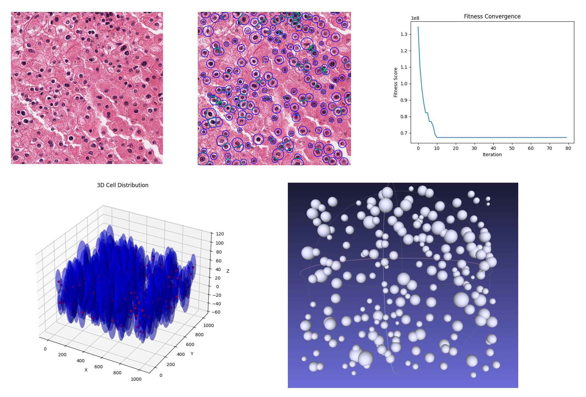

# CellSqueeze3D: 3D Cellular Reconstruction from 2D Histology Images

**Infer the spatial distribution and boundaries of individual cells from single HE slide patch**

## 📖 Overview 

Although H&E stained histology images are conventionally analyzed in 2D, the inherent thickness of the tissue section means they contain crucial 3D spatial information. This subtle cellular distribution, which manifests as nuclear overlap and morphological changes in 2D projection, offers rich insights into tissue architecture and pathology.

CellSqueeze3D is a novel computational framework that reconstructs cellular spatial distribution and size from a single H&E-stained section. Our method operates on the principle that the compression of cells into a 2D projection preserves critical 3D geometric features. The algorithm uses a hybrid optimization strategy, combining Particle Swarm Optimization (PSO) with biomechanical constraints such as avoiding cell overlap, to ensure biologically plausible reconstructions.

**Key Features** 

✔ 3D Reconstruction: Infers spatial distribution and boundaries of individual cells from 2D H&E images  
✔ Hybrid Optimization: Combines Particle Swarm Optimization with biomechanical constraints  
✔ Clinical Relevance: Reconstructed features correlate with tumor stage and gene expression profiles  
✔ High Performance: 95% accuracy in cell-type classification with 0.136 AUC improvement over traditional methods  
 

## 🛠 Installation

```git clone https://github.com/YankongSJTU/CellSqueeze3D.git
cd CellSqueeze3D
pip install -r requirements.txt
```

## 🛠 Project Structure
```bash
CellSqueeze3D/
├── Simulate_main.py          # Main training code
├── CreatDatasets.py          # Data loading and preprocessing
├── utils/
│   ├── utils.py             # Utility functions
│   ├── bound.py             # Visualization functions
│   └── DataSets.py          # DatasetLoader class for batch processing
├── downstreamTask/          # Downstream analysis code and demo data
└── data/                    # Data directory with download links and demo data
```

## 🚀 Quick Start
1. Data Preparation
```python
python CreatDatasets.py --datadir ./data/Demodata --splitlist splitlist.csv --basenamelen 6 --patchsize 1000

```
This command generates the training data file: Demodata.traindata.pkl
2. Run 3D Reconstruction
```python
python Simulate_main.py --data Demodata.traindata.pkl --save_freq 20 --checkpoints_dir checkpoints_demo
```
**Output Files**

    .ply files: 3D mesh files viewable in MeshLab software

    .json files: Contain predicted 3D cellular coordinates, cell radii, and boundary curves at Z=0 plane

<div>
 
</div>
## 🏆 Benchmark Results

Our method demonstrates significant improvements:

-  Predicted cell radii resulted in significantly different nuclear-to-cytoplasmic (N/C) ratio distribution (p=1.39×10⁻⁸⁰)
-  95% accuracy in cell-type classification with 0.136 AUC improvement
-  Shannon entropy of N/C ratio positively correlates with TNM stage of tumors
-  Cellular morphology features strongly correlate with gene expression profiles
-  Nuclear/cellular size indices predict mutation status of 21 genes in TCGA cohorts (median AUROC > 0.65)


## 📜 Applications

CellSqueeze3D enables:

✔ Enhanced computational pathology and quantitative tissue phenotyping 
✔ Novel prognostic insights through 3D cellular morphology 
✔ Correlation analysis with genetic mutations and expression profiles 
✔ Improved understanding of tissue architecture and pathology 


##  📧 Contact
For questions and support, please open an issue on GitHub or contact.
Please feel free to contact me (biogene2017@foxmail.com).

 
